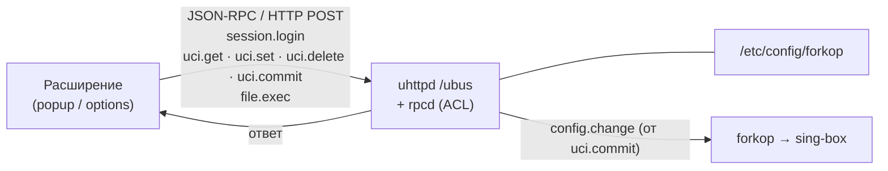

# Forkop Domains

Chrome/Edge-расширение (Manifest V3) для управления списком **ручных доменов**
секции forkop на роутере OpenWrt — напрямую через `ubus` (JSON-RPC поверх
HTTP), без захода на роутер по SSH.

> **TL;DR (EN).** An MV3 browser extension that edits the `domain` (exact) and
> `domain_suffix` (apex + subdomains) UCI lists of a forkop section on OpenWrt
> over `ubus`, applied with a single `uci commit` (forkop restarts itself via
> its `config.change` trigger). Two panels: manual domain editing with a
> per-entry exact/suffix toggle, and a per-tab request-domain collector
> (`webRequest`) grouped by registrable domain.

---

## Содержание

- [Что это делает](#что-это-делает)
- [Как это работает](#как-это-работает)
- [Установка расширения](#установка-расширения)
- [Подготовка роутера](#подготовка-роутера)
- [Настройка расширения](#настройка-расширения)
- [Использование](#использование)
- [Применение изменений](#применение-изменений)
- [Модель безопасности](#модель-безопасности)
- [Устройство проекта](#устройство-проекта)
- [Диагностика](#диагностика)
- [Ограничения](#ограничения)
- [Лицензия](#лицензия)

---

## Что это делает

forkop умеет матчить трафик по спискам доменов. Помимо готовых
community-списков есть два ручных матчера в секции (`/etc/config/forkop`):

- **`domain`** — точное совпадение имени хоста (`hapi.example.com` и ничего кроме);
- **`domain_suffix`** — сам домен и **все** его поддомены (`example.com` →
  `example.com`, `api.example.com`, `cdn.example.com`, …).

Обычно их правят через LuCI или руками по SSH. Это расширение даёт то же самое
из браузера:

### Панель «Домены»
- Выбор секции forkop.
- Единый список доменов секции — записи из `domain` и `domain_suffix` вместе,
  у каждой бейдж **точный** / **поддомены** (клик переключает).
- Добавление доменов (по одному или пачкой — через пробел/запятую) с выбором
  режима; по умолчанию **+ поддомены**.
- Удаление доменов.
- Правки копятся локально и показываются как `+N / −M / ↹K` (K — смена режима);
  на роутер уходят **одной кнопкой «Применить»** (чтобы не дёргать forkop на
  каждый чих).
- «Сбросить» — откат несохранённых правок.

> Хост, который на роутере лежит сразу в `domain` и `domain_suffix`, при чтении
> показывается как **поддомены** (suffix уже покрывает точное имя) и при
> «Применить» остаётся только в `domain_suffix`.

### Панель «Сбор»
- «Перезагрузить и собрать» — перезагружает активную вкладку и собирает все
  хосты, к которым она обращается (через `chrome.webRequest`).
- Хосты группируются по регистрируемому домену (компактный встроенный аналог
  Public Suffix List).
- Отмечаешь нужные группы → «Добавить выбранные» в выбранную секцию → добавятся
  как **`domain_suffix`** (собрал apex сайта → нужен весь сайт) → «Применить».

---

## Как это работает



1. `session.login` с логином/паролем rpcd-пользователя → `ubus_rpc_session`.
2. `uci.get {config:"forkop"}` → секции (те, у кого `.type == "section"`).
3. Чтение/запись листов: `uci.get / uci.set / uci.delete` для
   `forkop.<секция>.domain` и `forkop.<секция>.domain_suffix` (обе опции за
   один «Применить»).
4. `uci.commit {config:"forkop"}` — rpcd при коммите шлёт событие
   `config.change`, а у forkop есть procd-триггер `config.change → restart`.
   forkop перезапускается **ровно один раз**, как при LuCI «Save & Apply».
   Отдельный `file.exec /etc/init.d/forkop restart` расширение **не** делает —
   два teardown-а параллельно рвут nftables (см.
   [`applyCmd`](#настройка-расширения) для сборок без триггера).
5. Сессия ubus живёт ограниченное время; клиент делает **авто-релогин** один
   раз при `Permission denied` и повторяет запрос.

> Пустой список: `uci.set` с пустым массивом roутер отклоняет
> (`Invalid argument`). Поэтому при удалении всех доменов расширение делает
> `uci.delete` опции целиком — forkop это переваривает штатно (опции просто
> нет, как в дефолтном конфиге).

---

## Установка расширения

1. `chrome://extensions/` (или `edge://extensions/`).
2. Включить **Режим разработчика**.
3. **Загрузить распакованное расширение** → выбрать папку с этим репозиторием.
4. Дальше — [настроить подключение к роутеру](#настройка-расширения).

Расширение не публикуется в Chrome Web Store: оно требует широких прав
(`webRequest`, `<all_urls>`) и рассчитано на self-hosted-сценарий со своим
роутером.

---

## Подготовка роутера

Нужен OpenWrt с forkop и включённым ubus-over-HTTP.

### 1. Пакеты

```sh
# OpenWrt 24.10+ (apk)
apk add uhttpd-mod-ubus rpcd rpcd-mod-file
# OpenWrt 23.05 и старше (opkg)
opkg update && opkg install uhttpd-mod-ubus rpcd rpcd-mod-file
```

### 2. Отдельный rpcd-пользователь + узкий ACL

Не используйте `root`. Заведите пользователя только под это расширение.

Файл [`router/acl.d/forkop-domain-mgr.json`](router/acl.d/forkop-domain-mgr.json)
из репозитория положите в `/usr/share/rpcd/acl.d/`. Он даёт ровно:

| Ресурс | Права |
|---|---|
| `uci` config `forkop` | read, write |
| `ubus` object `session` | `login`, `access` |
| `ubus` object `uci` | `get`, `set`, `delete`, `commit` |
| `ubus` object `file` | только `exec` |
| `file` exec | только `/etc/init.d/forkop` |

Это ровно тот набор вызовов, который расширение делает — ни одного лишнего.
С 1.3.0 ACL урезан: убраны `uci add`, `file read/list/stat/write`, exec
`/usr/bin/forkop` и запись в `/etc/forkop-lists/*`. Старый, более широкий ACL
продолжит работать — обновить стоит ради принципа наименьших привилегий.

Затем создать пользователя (пароль — свой, не из примера):

```sh
PASS='ПРИДУМАЙТЕ_ПАРОЛЬ'
HASH="$(uhttpd -m "$PASS")"

cat >> /etc/config/rpcd <<EOF

config login
	option username 'forkop-ext'
	option password '$HASH'
	list read 'forkop-domain-mgr'
	list write 'forkop-domain-mgr'
EOF

/etc/init.d/rpcd restart
```

Или запустите готовый скрипт: [`router/setup.sh`](router/setup.sh)
(скопировать на роутер, `sh setup.sh <username> <password>`).

### 3. Проверка логина

```sh
curl -s http://127.0.0.1/ubus -d '{
  "jsonrpc":"2.0","id":1,"method":"call",
  "params":["00000000000000000000000000000000","session","login",
            {"username":"forkop-ext","password":"ВАШ_ПАРОЛЬ"}]
}'
```

В ответе должен быть `ubus_rpc_session`.

### 4. Доступ по сети

`/ubus` должен быть доступен с машины, где браузер. По умолчанию uhttpd
слушает на всех интерфейсах. Если ограничивали — откройте LAN.
Расширение шлёт запросы из своего фонового контекста, поэтому CORS и
mixed-content (HTTP-роутер) не мешают.

---

## Настройка расширения

Открыть страницу параметров расширения (ПКМ по иконке → «Параметры
расширения») и заполнить:

| Поле | Пример | Смысл |
|---|---|---|
| Адрес роутера | `http://192.168.1.1/` | база для `/ubus` |
| rpcd-пользователь | `forkop-ext` | из `/etc/config/rpcd` |
| Пароль | — | пароль этого пользователя |
| Команда применения | *авто* (пусто) | forkop сам перезапускается по `config.change` от `uci.commit`. `reload`/`restart` — только для сборок forkop без этого триггера |

Матчер (`domain` / `domain_suffix`) выбирается у каждой записи прямо на вкладке
«Домены» — отдельной настройки для этого больше нет.

«Сохранить», затем «Проверить связь» — должно показать список секций forkop.

Настройки лежат в `chrome.storage.local` — см.
[Модель безопасности](#модель-безопасности).

---

## Использование

### Добавить домены вручную
1. Иконка расширения → вкладка «Домены».
2. Выбрать секцию.
3. Выбрать режим (`+ поддомены` / `точный`), вписать
   `example.com, sub.example.org` → `+`.
4. При необходимости кликнуть бейдж у записи, чтобы сменить режим.
5. Внизу появится `+2 / −0` → «Применить».

### Собрать домены со страницы
1. Открыть нужный сайт в соседней вкладке, оставить её активной.
2. Иконка расширения → вкладка «Сбор» → «Перезагрузить и собрать».
3. Через несколько секунд появится список сгруппированных доменов.
4. Отметить нужные, выбрать секцию, «Добавить выбранные» → «Применить».

---

## Применение изменений

Изменение списков `domain` / `domain_suffix` меняет маршрутные правила
sing-box, а sing-box не подхватывает конфиг на лету — процесс перезапускается,
и активные соединения через прокси на несколько секунд рвутся. Полностью
бесшовно — никак. `uci.commit` пересобирает обе опции; изменение применяется
за ~10–15 секунд.

**Как это делает расширение.** Только `uci.commit`. rpcd при коммите шлёт
событие `config.change`; у forkop есть procd-триггер `config.change → restart`,
и он перезапускается один раз — ровно как при LuCI «Save & Apply».

**Почему не `file.exec /etc/init.d/forkop restart`.** Тогда идут два teardown-а
параллельно (свой + по триггеру от коммита); второй `flush` может снести
nftables-таблицу во время старта первого — трафик через прокси перестаёт
ходить до ручного `restart`. Именно поэтому в 1.1.0 явный вызов убран.

**Поле «Команда применения» (`applyCmd`).** По умолчанию пусто. Заполняйте
(`reload` / `restart`), только если ваша сборка forkop **не** перезапускается
сама по `config.change` — проверить: `grep config.change /etc/init.d/forkop`.

---

## Модель безопасности

- **Пароль хранится в `chrome.storage.local` в открытом виде** и уходит по HTTP,
  если роутер не за TLS. Это не секьюрное хранилище. Поэтому:
  - заводите отдельного rpcd-пользователя, а не root;
  - используйте узкий ACL из репозитория: он позволяет только править конфиг
    `forkop` и запускать `/etc/init.d/forkop`;
  - оцените риск трезво: этим пользователем можно **менять маршрутизацию
    трафика вашей сети** (какие домены идут через прокси) и перезапускать
    forkop. Шелла и доступа к остальной системе он не даёт, но «безобидным» его
    называть нельзя.
- Расширение обращается **только** к адресу роутера из настроек (адрес
  валидируется и приводится к схеме при сохранении). Никакой телеметрии,
  никаких внешних запросов.
- Права расширения:
  - `webRequest` + `<all_urls>` — читать список хостов, к которым обращаются
    вкладки (только для панели «Сбор»; запросы не блокируются и не меняются);
  - `webNavigation` — сбрасывать накопленный список при переходе на новую
    страницу;
  - `tabs` — узнать активную вкладку и перезагрузить её;
  - `storage` — хранить настройки и временный буфер сбора.

---

## Устройство проекта

```
manifest.json          MV3-манифест
background.js           service worker: сбор хостов по вкладкам (webRequest),
                        merge-запись в chrome.storage.session
icons/                  иконки 16/32/48/128
lib/
  ubus.js              клиент ubus: login, uci get/set/delete/commit, file.exec,
                       таймауты (AbortSignal), нормализация адреса,
                       авто-релогин на Permission denied / JSON-RPC -32002
  domains.js           normalizeHost, isIp, registrable, groupByRegistrable
popup/
  popup.html/.css/.js  UI двух панелей, pending/committed как Map<host,mode>
                       (exact→domain, suffix→domain_suffix), «Применить»
options/
  options.html/.js     форма настроек + «Проверить связь»
router/
  acl.d/forkop-domain-mgr.json   ACL для rpcd
  setup.sh                        скрипт создания rpcd-пользователя
```

Ключевые детали реализации:

- `uci.get` для отсутствующей опции возвращает пустой объект → трактуется как
  пустой список.
- Секции: `Object.values(uciGetAll('forkop'))`, где `s['.type'] === 'section'`
  и имя ≠ `settings`.
- Список хостов вкладки живёт в `chrome.storage.session`; память воркера —
  только кэш. Запись **мержится** с сохранённым (выгрузка воркера иначе
  обнулила бы сбор), чтение объединяет оба источника, а перезаписывают только
  две точки сброса: `webNavigation.onBeforeNavigate` главного фрейма и
  «Перезагрузить и собрать».
- `apply()` работает со снимком секции и `pending`, а UI на это время заблокирован.
- Каждое чтение секции помечено токеном — устаревший ответ не затирает список.
- Все ubus-запросы с таймаутом: 10 с на чтение/логин, 40 с на `commit`/`exec`.

---

## Диагностика

| Симптом | Причина / что делать |
|---|---|
| «Проверить связь»: `Login: не вернулся ubus_rpc_session` | неверный логин/пароль, или пользователь не заведён в `/etc/config/rpcd` |
| `Permission denied` при чтении/записи | ACL-файл не на месте или `rpcd` не перезапущен; проверьте `ls /usr/share/rpcd/acl.d/` и `/etc/init.d/rpcd restart` |
| `Сеть/CORS: не достучались до …/ubus` | роутер недоступен по этому адресу, или не установлен `uhttpd-mod-ubus` |
| `HTTP 404 от …/ubus` | нет `uhttpd-mod-ubus` |
| forkop падает после «Применить» | смотрите `logread \| grep forkop`; проверьте, что ваша сборка forkop поддерживает `domain` и `domain_suffix` в этой секции |
| Сайт открывается, но не работает / «Лицензирован» / видео не грузится | фронт есть в списке, а API/CDN/плеер живут на поддоменах или отдельных доменах. Соберите их через «Сбор» и добавьте (обычно как `domain_suffix`) |
| После «Применить» трафик через прокси перестаёт ходить (до ручного `restart`) | двойной перезапуск forkop. Убедитесь, что «Команда применения» = *авто* (пусто); одного `uci.commit` достаточно |
| Список секции внезапно «пустой» | вероятно, открылась не та секция. С 1.1.0 расширение помнит последнюю; проверьте выпадашку «Секция» |
| Долгий провал связи на «Применить» | forkop дольше поднимается при первом старте (качает community-списки) — подождите ~20–40 с |
| `ubus …: TIMEOUT` | роутер не ответил за отведённое время (10 с на чтение, 40 с на `commit`). Если это было «Применить» — изменения могли примениться: переоткройте попап и посмотрите список |
| `… отвечает редиректом` | роутер перекидывает http→https (или наоборот). Укажите в настройках точный адрес со схемой, по которому `/ubus` отдаётся напрямую |
| «Не похоже на домены, пропущено: …» | введён IP-адрес или строка без валидного TLD. `domain`/`domain_suffix` — матчеры имён; IP forkop так не примет |
| «Сначала «Применить» или «Сбросить»» при смене секции | в текущей секции есть несохранённые правки; переключение их бы потеряло |

На роутере полезно:

```sh
uci show forkop | grep -E 'domain|domain_suffix'   # что реально в конфиге
logread | grep -i forkop | tail -30    # ход применения, ошибки
/etc/init.d/forkop status
```

---

## Ограничения

- Встроенная группировка по регистрируемому домену использует **компактный**
  список суффиксов, а не полный PSL: перечень частых двухуровневых ccTLD плюс
  эвристика `com|net|org|co|ac|…` + двухбуквенная зона, плюс набор
  «приватных» суффиксов (`github.io`, `vercel.app`, `amazonaws.com`,
  `cloudfront.net`, …). **Метка группы уходит в конфиг дословно**, поэтому
  редкий суффикс, которого нет в списке, может дать группу на метку шире или
  уже, чем хочется — проверяйте, что именно отмечаете, перед «Применить».
  Промах в сторону «уже» безопаснее: правило окажется точнее, а не проксирует
  лишнее.
- Панель «Сбор» отбрасывает всё, что не является доменным именем (IP-литералы,
  `.onion`-подобные и синтаксически невалидные хосты) — такие записи в forkop
  не попадут.
- Расширение не создаёт секции forkop и не трогает ничего, кроме листов
  `domain` / `domain_suffix` и (опционально) вызова `reload`/`restart`.
- Тестировалось на forkop 1.0.5 / OpenWrt 24.10+ с `sing-box`.

---

## Лицензия

MIT — см. [LICENSE](LICENSE).

Проект не аффилирован с forkop и OpenWrt.
